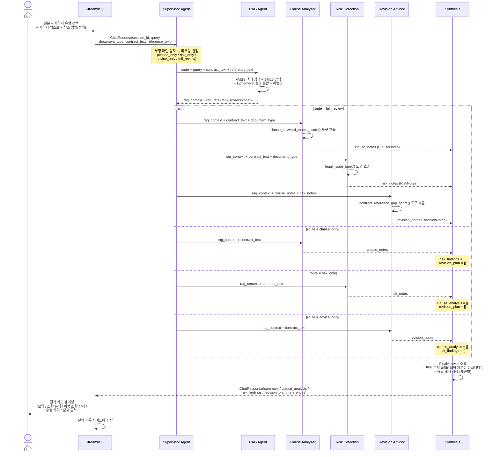

# LegalPilot AI — 서비스 플로우 시퀀스

## 시퀀스 다이어그램



## 라우팅 결정 규칙

| 라우트 | 트리거 패턴 예시 | 실행 에이전트 | 비어 있는 필드 |
|---|---|---|---|
| `clause_only` | "조항 분석만 해줘", "조항 위주로", "조항 검토만" | Clause Analyzer | `risk_findings`, `revision_plan` |
| `risk_only` | "위험 조항만 알려줘", "법적 우려만", "리스크 중심" | Risk Detection | `clause_analysis`, `revision_plan` |
| `advice_only` | "수정 계획만 작성해줘", "개선 방향만" | Revision Advisor | `clause_analysis`, `risk_findings` |
| `full_review` | "전체 검토", "통합 분석", "조항·위험·수정 모두" | Clause + Risk + Advice | (없음) |

## 부정 패턴 탐지 로직

- `CLAUSE_ONLY_MARKERS`: `("조항만", "조항 분석만", "조항 위주로", ...)` 토큰 매칭
- `NEGATION_PATTERNS`: `("아니야", "제외는 아니야", ...)` 패턴 탐지 시 LLM 재판단 위임
- 모호한 질의(예: "계약서 전반을 도와줘")는 `full_review`로 폴백

## 데이터 흐름 요약

```
User Input
    └─► Supervisor (route 결정)
            └─► RAG (rag_context + rag_refs)
                    ├─► Clause Analyzer → ClauseNotes
                    ├─► Risk Detection  → RiskNotes
                    └─► Revision Advisor → RevisionNotes
                                └─► Synthesis → FinalAnswer (JSON)
                                                    └─► UI 렌더링
```
