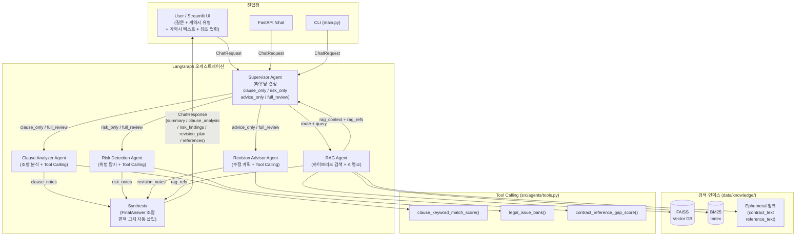

# LegalPilot AI — 시스템 아키텍처

## 아키텍처 다이어그램

## 주요 구성 요소

| 컴포넌트 | 파일 | 역할 |
|---|---|---|
| Supervisor Agent | `src/workflow/engine.py` | 질의 의도 분류 → route 결정, RAG 컨텍스트 주입 |
| RAG Agent | `src/retrieval/hybrid.py` | FAISS(벡터) + BM25(키워드) 하이브리드 검색, 리랭크, Ephemeral 청크 혼합 |
| Clause Analyzer Agent | `src/workflow/engine.py` | 계약 조항 법령 기준 대비 분석, `clause_keyword_match_score` 호출 |
| Risk Detection Agent | `src/workflow/engine.py` | 위험 조항 탐지 및 법적 리스크 코칭, `legal_issue_bank` 호출 |
| Revision Advisor Agent | `src/workflow/engine.py` | 구체적 수정 계획 생성, `contract_reference_gap_score` 호출 |
| Synthesis | `src/workflow/engine.py` | Pydantic `FinalAnswer` 구조화, 면책 고지 삽입, 응답 캐시 |
| FAISS / BM25 | `src/retrieval/documents.py` | `data/knowledge/` 4개 카테고리 인덱싱 |

## 지식 베이스 카테고리

| 디렉토리 | 내용 |
|---|---|
| `data/knowledge/statutes/` | 법령 요약본 (근로기준법, 주택임대차보호법 등) |
| `data/knowledge/standard_contracts/` | 표준 계약서 (고용부 표준 근로계약서 등) |
| `data/knowledge/case_guides/` | 분쟁 사례 가이드 (판례 요약, 실무 시사점) |
| `data/knowledge/contract_examples/` | 계약서 문제 조항 예시 및 수정 방향 |
